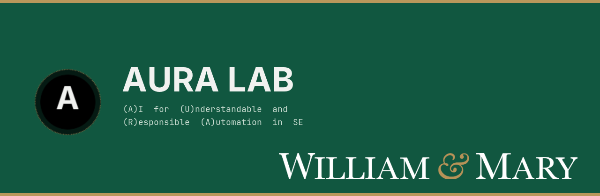

<p align="center">
  
</p>

<p align="center">
  William &amp; Mary · Computer Science<br>
  <a href="https://aura-se-lab.github.io">Lab website</a>
  ·
  <a href="https://antoniomastropaolo.com">PI — Antonio Mastropaolo</a>
</p>

We build **responsible AI for software engineering**: automation you can understand, at a cost you can afford. Founded Fall 2024.

<table>
<tr>
<td width="33%" valign="top">

**Research**<br>
Energy-efficient code models, agent evaluation, neurosymbolic SE.

[`research-swebench-dominance`](https://github.com/aura-lab-wm/research-swebench-dominance)

</td>
<td width="33%" valign="top">

**Teaching**<br>
COLL 100 · GenAI4SE. The platform is [codelab.sh](https://github.com/aura-lab-wm/teaching-coll100-codelab).

</td>
<td width="33%" valign="top">

**Systems**<br>
[Rocco](https://github.com/aura-lab-wm/project-rocco-code) (lab GPU agents), [AuraCron](https://github.com/aura-lab-wm/project-auracron), [design-kit](https://github.com/aura-lab-wm/design-kit).

</td>
</tr>
</table>

### People

Ph.D. — [Afia Farjana](https://github.com/aura-lab-wm/student-aura-afia-farjana) · [Saima Afrin](https://github.com/aura-lab-wm/student-aura-saima-afrin) · [Zahidul Haque](https://github.com/aura-lab-wm/student-aura-zahidul-haque) · [Aya Garryyeva](https://github.com/aura-lab-wm/student-aura-aya-garryyeva) · [Joseph Call](https://github.com/aura-lab-wm/student-aura-joseph-call) · [Chris Cheng](https://github.com/aura-lab-wm/student-aura-chris-cheng) · [Khai Nguyen](https://github.com/aura-lab-wm/student-aura-khai-nguyen) (alumni)

---

<details>
<summary><strong>How we file work on this org</strong> — walk-in test, naming, skills, ops</summary>

<br>

A new repo walks **top to bottom** and stops at the first match.

```
research → teaching → products → people → identity → ops
```

Full rules: **[MANIFESTO.md](MANIFESTO.md)**.

</details>
