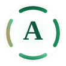
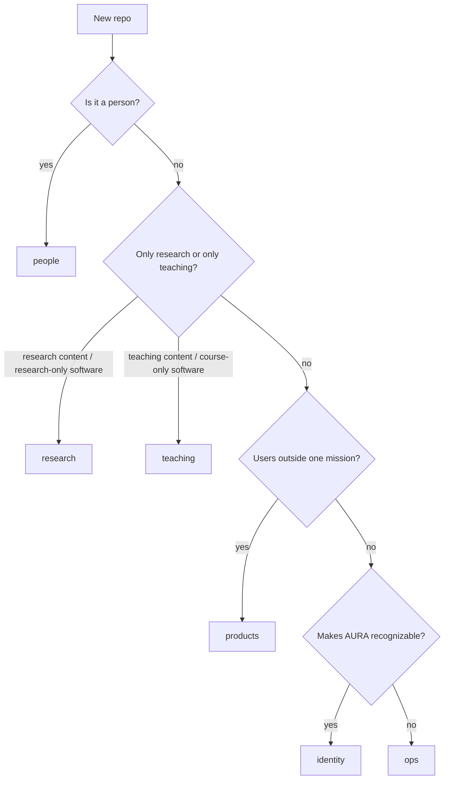

<p align="center">
  
</p>

<h1 align="center">AURA Lab</h1>

<p align="center">
  <strong>(A)</strong>I for
  <strong>(U)</strong>nderstandable and
  <strong>(R)</strong>esponsible
  <strong>(A)</strong>utomation in Software Engineering
</p>

<p align="center">
  
  &nbsp;·&nbsp; Computer Science
</p>

<p align="center">
  <a href="https://github.com/aura-lab-wm/skills"><code>skills</code></a>
  ·
  <a href="https://github.com/aura-lab-wm/design-kit"><code>design-kit</code></a>
  ·
  <a href="https://github.com/aura-lab-wm/web-auralab"><code>web-auralab</code></a>
  ·
  <a href="https://github.com/aura-lab-wm/teaching-coll100-codelab"><code>codelab.sh</code></a>
</p>

---

# How we file work

GitHub is a flat list. This is the legend. A new repo walks **top to bottom** and stops at the first match.



```
AURA
├── research    what we find out
├── teaching    what we teach
├── products    software with users outside one mission
├── people      who is / was in the lab
├── identity    how outsiders recognize AURA
└── ops         how the lab runs itself
```

| # | Room | Walks in iff |
|---|---|---|
| 1 | **people** | the repo *is* a person |
| 2 | **research** / **teaching** | it *is* that mission’s content, or software whose **only** users are that mission |
| 3 | **products** | released software, more than one mission **or** users outside the lab |
| 4 | **identity** | its job is making AURA recognizable |
| 5 | **ops** | automates how the lab works **and failed every test above** |

Ops is a **negative** test, not “anything Claude-shaped.”

## Naming

Path with `/` becomes `-` on GitHub.

| Path | Repo |
|---|---|
| `research/<slug>` | `research-<slug>` |
| `teaching/<course>/<year>` | `teaching-<course>-<year>` |
| `teaching/<course>/<year>/<netid>` | `teaching-<course>-<year>-<netid>` |
| `teaching/coll100/codelab` | `teaching-coll100-codelab` |
| `project/<name>/…` | `project-<name>-…` |
| `student/aura\|grad\|undergrad/<name>` | `student-aura\|grad\|undergrad-<name>` |
| `design/kit` | `design-kit` |
| `design/kit/logos` | `design-kit-logos` |
| `design/slides` | `design-slides` |
| `web/<site>` | `web-<site>` |
| `ops/<tool>` | `ops-<tool>` |
| `ops/skills` | `skills` |

Do **not** put a venue in a research name.  
Do **not** put a year on a platform.  
Kit owns tokens; slides consume them; logos are marks only.

## Skills

**Default:** [`skills`](https://github.com/aura-lab-wm/skills), under a domain folder (`research/`, `workday/`, `macos/`, …).

**Exception:** if the skill *is* the product, it lives in that product. `skills/elsewhere/` keeps the pointer.

Today: lecture skill → [`design-slides`](https://github.com/aura-lab-wm/design-slides).

## Ops

```
ops/skills           skills
ops/reimbursement    ops-reimbursement
ops/telemetrify      ops-telemetrify
ops/toast            ops-toast
ops/key-agent        ops-key-agent
ops/phd-defence      ops-phd-defence
```

A hook that exists only to enforce `design-kit` is **identity**, not ops.

## Adding a repo

1. Run the walk-in test. Do not skip to ops.
2. Name it from the table.
3. One GitHub **topic** = the room.
4. If it is a skill, follow Skills above.

## Live map

| Room | Repos |
|---|---|
| research | [`research-swebench-dominance`](https://github.com/aura-lab-wm/research-swebench-dominance) |
| teaching | [`teaching-coll100-codelab`](https://github.com/aura-lab-wm/teaching-coll100-codelab), [`teaching-coll100-2026`](https://github.com/aura-lab-wm/teaching-coll100-2026), [`teaching-genai4se-2026`](https://github.com/aura-lab-wm/teaching-genai4se-2026) + netid copies |
| products | [`project-rocco-code`](https://github.com/aura-lab-wm/project-rocco-code), [`project-rocco-web`](https://github.com/aura-lab-wm/project-rocco-web), [`project-rocco-student-kit`](https://github.com/aura-lab-wm/project-rocco-student-kit), [`project-auracron`](https://github.com/aura-lab-wm/project-auracron) |
| people | `student-aura-*` |
| identity | [`web-auralab`](https://github.com/aura-lab-wm/web-auralab), [`design-kit`](https://github.com/aura-lab-wm/design-kit), [`design-kit-logos`](https://github.com/aura-lab-wm/design-kit-logos), [`design-slides`](https://github.com/aura-lab-wm/design-slides) |
| ops | [`skills`](https://github.com/aura-lab-wm/skills), [`ops-reimbursement`](https://github.com/aura-lab-wm/ops-reimbursement), [`ops-telemetrify`](https://github.com/aura-lab-wm/ops-telemetrify), [`ops-toast`](https://github.com/aura-lab-wm/ops-toast), [`ops-key-agent`](https://github.com/aura-lab-wm/ops-key-agent), [`ops-phd-defence`](https://github.com/aura-lab-wm/ops-phd-defence) |
