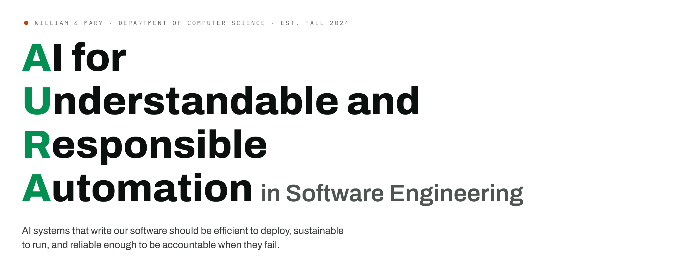
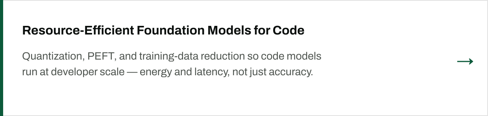
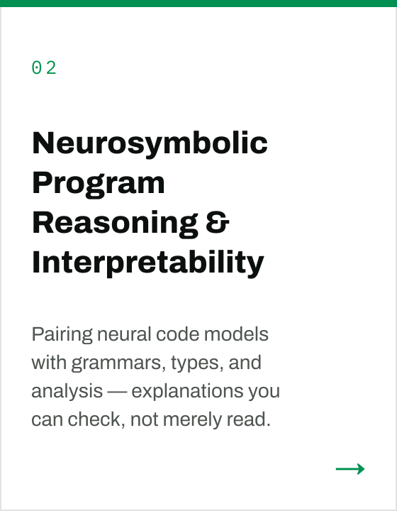
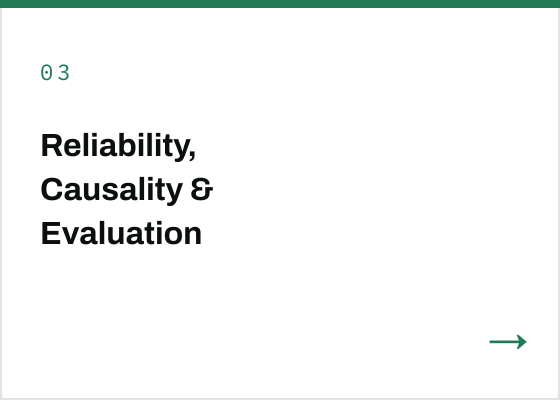
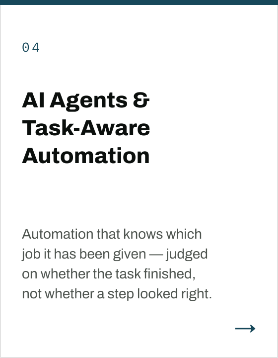
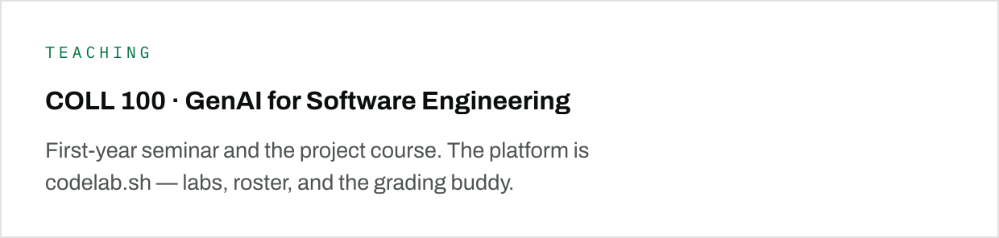
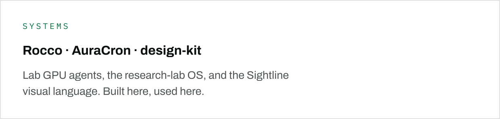
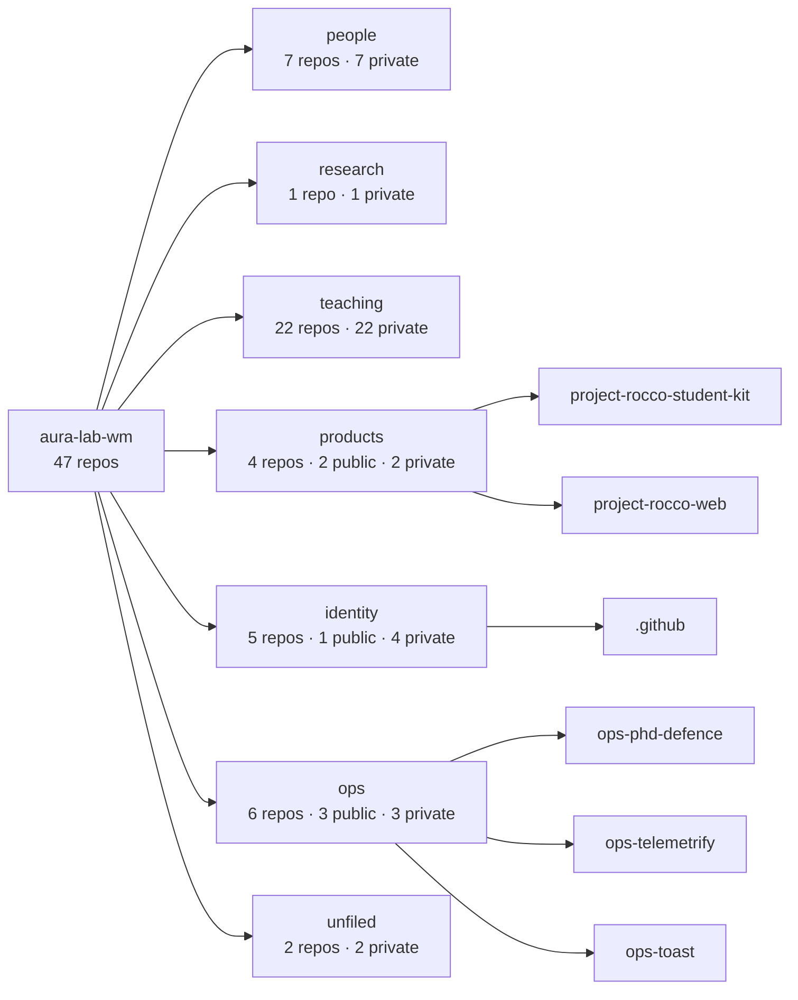

<p align="center">
  <a href="https://auralab.sh">
    
  </a>
</p>

<p align="center">
  <a href="https://auralab.sh">Lab website</a>
  ·
  <a href="https://antoniomastropaolo.io">PI — Antonio Mastropaolo</a>
  ·
  <a href="https://auralab.sh/join/">Join the lab</a>
</p>

<p align="center">
  <sub>FOUR RESEARCH DIRECTIONS</sub>
</p>

<table>
  <tr>
    <td width="25%" valign="top">
      <a href="https://auralab.sh/research/efficient-models/"></a>
    </td>
    <td width="25%" valign="top">
      <a href="https://auralab.sh/research/neurosymbolic-interpretability/"></a>
    </td>
    <td width="25%" valign="top">
      <a href="https://auralab.sh/research/reliable-evaluation/"></a>
    </td>
    <td width="25%" valign="top">
      <a href="https://auralab.sh/research/agents-lifecycle/"></a>
    </td>
  </tr>
</table>

<table>
  <tr>
    <td width="50%" valign="top">
      <a href="https://github.com/aura-lab-wm/teaching-coll100-codelab"></a>
    </td>
    <td width="50%" valign="top">
      <a href="https://github.com/aura-lab-wm/project-rocco-code"></a>
    </td>
  </tr>
</table>

<p align="center">
  <sub>PH.D.</sub><br>
  <a href="https://github.com/aura-lab-wm/student-aura-afia-farjana"></a>
  <a href="https://github.com/aura-lab-wm/student-aura-saima-afrin"></a>
  <a href="https://github.com/aura-lab-wm/student-aura-zahidul-haque"></a>
  <a href="https://github.com/aura-lab-wm/student-aura-aya-garryyeva"></a>
  <a href="https://github.com/aura-lab-wm/student-aura-joseph-call"></a>
  <a href="https://github.com/aura-lab-wm/student-aura-chris-cheng"></a>
</p>

<p align="center">
  <a href="https://github.com/aura-lab-wm/student-aura-afia-farjana">Afia Farjana</a>
  ·
  <a href="https://github.com/aura-lab-wm/student-aura-saima-afrin">Saima Afrin</a>
  ·
  <a href="https://github.com/aura-lab-wm/student-aura-zahidul-haque">Zahidul Haque</a>
  ·
  <a href="https://github.com/aura-lab-wm/student-aura-aya-garryyeva">Aya Garryyeva</a>
  ·
  <a href="https://github.com/aura-lab-wm/student-aura-joseph-call">Joseph Call</a>
  ·
  <a href="https://github.com/aura-lab-wm/student-aura-chris-cheng">Chris Cheng</a>
</p>

---

<details>
<summary><strong>How we file work on this org</strong> — walk-in test, naming, skills, ops</summary>

<br>

A new repo walks **top to bottom** and stops at the first match.

```
research → teaching → products → people → identity → ops
```

Full rules: **[MANIFESTO.md](MANIFESTO.md)**.

</details>

<!-- REPO-MAP:START -->

<p align="center"><sub>REPOSITORY MAP · 47 repos · 6 public · generated 2026-09-19 01:18 UTC · <a href="MANIFESTO.md">filing rules</a></sub></p>



| Room | Repos | Public | Private | Last push |
|---|---:|---|---:|---|
| **people** | 7 | — | 7 | 2026-09-15 |
| **research** | 1 | — | 1 | 2026-09-13 |
| **teaching** | 22 | — | 22 | 2026-09-18 |
| **products** | 4 | [`project-rocco-student-kit`](https://github.com/aura-lab-wm/project-rocco-student-kit), [`project-rocco-web`](https://github.com/aura-lab-wm/project-rocco-web) | 2 | 2026-09-12 |
| **identity** | 5 | [`.github`](https://github.com/aura-lab-wm/.github) | 4 | 2026-09-18 |
| **ops** | 6 | [`ops-phd-defence`](https://github.com/aura-lab-wm/ops-phd-defence), [`ops-telemetrify`](https://github.com/aura-lab-wm/ops-telemetrify), [`ops-toast`](https://github.com/aura-lab-wm/ops-toast) | 3 | 2026-09-15 |
| **unfiled** | 2 | — | 2 | 2026-09-18 |

<sub><b>unfiled</b> names match no rule in the naming table — file them or extend the table.</sub>

<sub>Regenerated hourly by <code>.github/workflows/repo-map.yml</code>. Private repositories are counted, never named.</sub>

<!-- REPO-MAP:END -->
